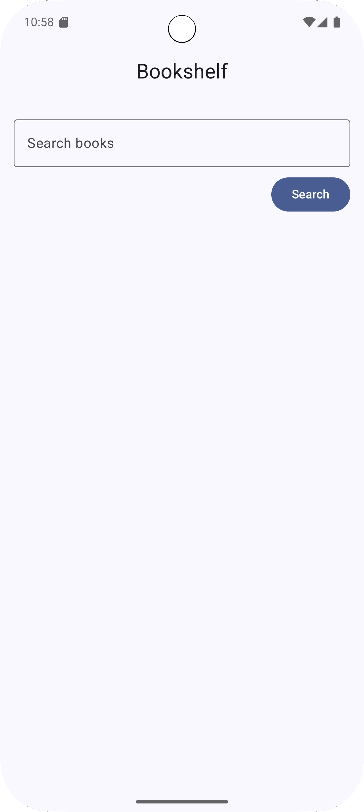
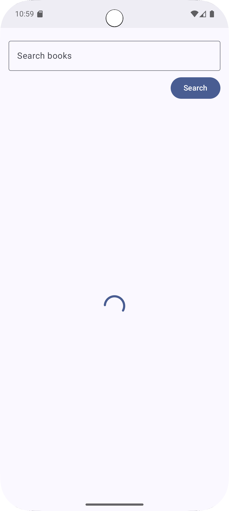

# 📚 Bookshelf App

Bookshelf is an Android app built with **Kotlin** following **Clean Architecture** principles.  
It allows users to search books via the **Google Books API**, view details, and manage a cart of favorite books.  

---

## 🚀 Features
- 🔍 **Search** books by topic using the Google Books API  
- 🖼️ Display books in a **grid of images**  
- 📖 View **detailed information** about each book  
- 🛒 Add and manage books in a **cart**  
- 🎨 Built with **Jetpack Compose** for modern UI  

---

## 🏗️ Architecture
This project follows **Clean Architecture** and the **MVVM (Model-View-ViewModel)** pattern:
- **Repository Pattern** – separates data sources from UI logic
- **ViewModel** – holds UI state & business logic
- **Dependency Injection** – through a simple `AppContainer`
- **Retrofit + GSON** – for network and JSON parsing

---

## 🛠️ Tech Stack
- **Language**: Kotlin
- **UI**: Jetpack Compose
- **Architecture**: MVVM + Clean Architecture
- **Networking**: Retrofit + GSON
- **Asynchronous**: Coroutines + Flow
- **Dependency Management**: AppContainer

---

## 📸 Screenshots

| Home Screen                      | Books                             | Loading screen               |
|----------------------------------|-----------------------------------|------------------------------|
|  |  |  |

---
